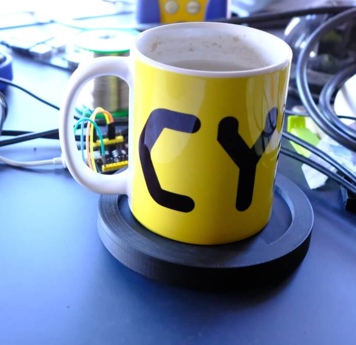

tealemetry, a tea coaster that has telemetry
===

While this is the code dump for a blog post I've done, you can find the ESP8266 code, a FreeCAD file, and the STL file for the coaster for 3d printing.

The required breakdown of stuff you need to make this is roughtly:

	* 1 ESP8266 12F
	* 1 MLX90616 ( with 5v compatible breakout board )
	* MicroUSB cable + Stable PSU to keep it going 24/7

